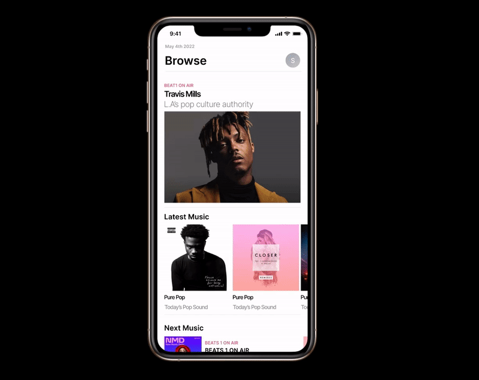
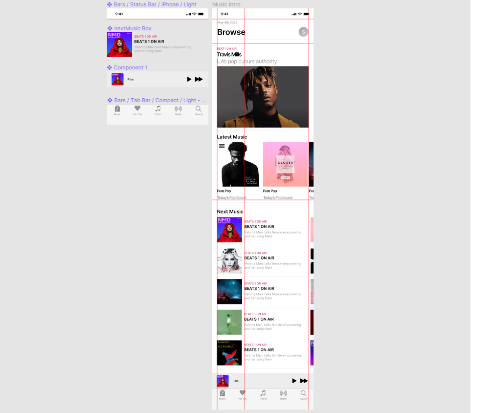

# MusicStreamingApp
> This repo contains the mobile application of music streaming by using Figma and Zeplin.
>
>Link: https://youtube.com/playlist?list=PL4UVBBIc6giJfhwzLnjDbyXL9tG_cHIo1 (in Korean)

<!-- CONTENTS -->
## Contents
* HTML
* CSS
* jQuery

<!-- VERSION -->
## Version
<a href="https://devsamlee.github.io/MusicStreamingApp/bananaMusic01.html">bananaMusic01.html</a> 
<a href="https://devsamlee.github.io/MusicStreamingApp/bananaMusic02.html">bananaMusic02.html</a> 
<a href="https://devsamlee.github.io/MusicStreamingApp/bananaMusic03.html">bananaMusic03.html</a> 
<a href="https://devsamlee.github.io/MusicStreamingApp/bananaMusic04.html">bananaMusic04.html</a> 
<a href="https://devsamlee.github.io/MusicStreamingApp/bananaMusic05.html">bananaMusic05.html</a> 

<!-- OVERVIEW -->
## Overview
| Prototype |  
|---------------------|
|  |

| Figma overview |  
|---------------------|
|  |

| Figma component |  
|---------------------|
|  |

<!-- CONTACT -->
## Contact
Sam Lee - [@LinkedIn](https://www.linkedin.com/in/sam-lee-dev/) - LeeSam235711@gmail.com

(<a href="#top">back to top</a>)

